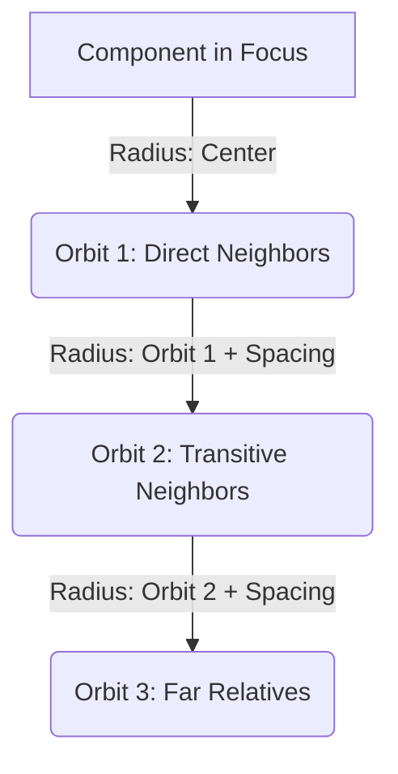

# Archstats UI: LLM Reference Manual & Visualization Architecture Catalog

This document is a self-contained, high-density reference manual for Large Language Models (LLMs) analyzing the **Archstats UI** frontend repository. It documents the technical stack, directory layout, client-side WebAssembly SQLite querying mechanics, D3-based Concentric Cousins coordinate calculations, and interactive Coupling Flow visual algorithms.

---

## 📁 Repository Directory Map & Frontend Architecture

Archstats UI is a single page application built on **Vue 3, Nuxt 3, TypeScript, Pinia, and TailwindCSS**.

*   **`pages/`**: Manages application routing and views.
    *   `views/components/plotter.vue`: Multi-dimensional scatter plot dashboard allowing users to correlate any two metrics (e.g. Betweenness Centrality vs Git Commits Churn).
    *   `views/components/matrix.vue`: Symmetrical Dependency Structure Matrix (DSM).
    *   `views/components/[name]/index.vue`: Component Overview / Executive Diagnostic Dashboard.
    *   `views/components/[name]/static-coupling.vue`: The static coupling view grouping D3 diagrams.
*   **`components/`**: Interactive visualization components.
    *   `components/cousins/CousinsDiagram.vue`: SVG Concentric Cousins D3-based network map.
    *   `components/single-component/CouplingFlow.vue`: Draggable, zoomable, and expandable dependency flow map.
*   **`stores/`**: Pinia state management.
    *   `data.ts`: Orchestrates loading WebAssembly SQLite engine (`sql.js`), parsing `.db` uploads, and managing active project directory scopes.
*   **`utils/`**: Shared algorithms.
    *   `stat_resolver.ts`: Bridges SQLite column naming versions to friendly nice names.
    *   `components.ts`: Graph model definitions (predecessors, successors, cycle-finders).

---

## 💾 Client-Side WebAssembly SQLite Integration (`stores/data.ts`)

Archstats UI operates as a serverless static application. It executes database queries completely in the user's browser using **`sql.js`** (SQLite compiled to WebAssembly):

### 1. Database Initialization
When a user uploads a database blob, the store initializes the SQLite database client-side:
```typescript
async setViews(views: ArrayBuffer) {
  let SQL = await initSqlJs({
    locateFile: (file: string) => `/${file}`
  });
  this.sqliteDatabase = new SQL.Database(new Uint8Array(views));
}
```

### 2. Reactive In-Browser Querying
The store exposes a `query` getter that prepares statements, loops through rows, and outputs standard JSON records:
```typescript
query<T>(state: any) {
  return (qryString: string): T[] => {
    const toReturn = []
    if (!state.sqliteDatabase) return []
    const stmt = state.sqliteDatabase.prepare(qryString)
    while (stmt.step()) {
      toReturn.push(stmt.getAsObject())
    }
    return toReturn
  }
}
```

---

## 🌀 D3 concentric Cousins Diagram (`CousinsDiagram.vue`)

The Concentric Cousins Diagram maps transitive dependency hops (predecessors or successors) as concentric orbits.



### 1. Orbit Radius Coordinates Calculation
For each hop level (shortest path length), components are grouped and placed on circular orbits:
*   **Orbit Diameter**: The radius for each level is computed by accumulating a minimum distance between orbits ($150\text{px}$) and fitting the circumference based on node counts to prevent node collisions:
    $$\text{circumference} = \text{nodeCount} \times (\text{nodeRadius} + \text{padding})$$
    $$\text{orbitRadius} = \max\left(\frac{\text{circumference}}{2\pi},\, \text{prevOrbitRadius} + 150\right)$$
*   **Radial Placement Trigonometry**: Nodes are placed evenly along the orbit's circumference:
    $$x = \text{halfCanvas} + \text{calculatedRadius} \times \cos\left(\frac{2\pi \times \text{nodeIndex}}{\text{totalNodes}}\right)$$
    $$y = \text{halfCanvas} + \text{calculatedRadius} \times \sin\left(\frac{2\pi \times \text{nodeIndex}}{\text{totalNodes}}\right)$$

### 2. D3 Zoom and Pan Matrix Wiring
Panning and zooming are handled using `d3.zoom` bound to the SVG template reference. The active scale/translation matrix computes a reactive viewBox:
```typescript
const transform = ref(d3.zoomIdentity);
const viewBox = computed(() => {
  const { k, x, y } = transform.value;
  return `${-x / k} ${-y / k} ${canvasSize / k} ${canvasSize / k}`;
});
```

---

## 🌳 Interactive Coupling Flow Diagram (`CouplingFlow.vue`)

The Coupling Flow diagram visualizes immediate and transitive dependency paths as a symmetric tree fanning outward from the selected component.

### 1. Symmetrical Three-Column Coordinate Spacing
*   **Left Column (Inbound Dependents)**: Placed at coordinate $x = 270\text{px}$ ($x = 140\text{px}$ if level 2 is collapsed).
*   **Center Column (Component in Focus)**: Placed at coordinate $x = \text{canvasWidth}/2$.
*   **Right Column (Outbound Dependencies)**: Placed at coordinate $x = 680\text{px}$ ($x = 810\text{px}$ if level 2 is collapsed).
*   **Outer Columns (Level 2 Nested Expansion)**: Leftmost at $x = 40\text{px}$ and rightmost at $x = 910\text{px}$.

### 2. Collapsible Subtree Fanning & Dynamic Height Calculation
*   Nodes with downstream relationships are expandable (displaying a `+` badge). Clicking a node adds it to `expandedLeftNodes` or `expandedRightNodes` arrays.
*   Y-coordinates are calculated dynamically based on row indexes. Expanding a parent node pushes neighboring nodes downward, dynamically resizing the SVG's height:
    $$\text{height} = \max\left(320,\, \text{maxNodes} \times 68 + \text{expandedNodesCount} \times 120 + 80\right)$$
*   Connection curves are drawn using smooth bezier paths:
    ```typescript
    function drawCurve(x1: number, y1: number, x2: number, y2: number) {
      const dx = Math.abs(x2 - x1) * 0.5;
      return `M ${x1} ${y1} C ${x1 + dx} ${y1}, ${x2 - dx} ${y2}, ${x2} ${y2}`;
    }
    ```

---

## 🔬 UI Exploratory Analysis Workflows

An exploratory LLM can guide users to analyze their system using the frontend's visual components:

### 1. Diagnosing Architectural Volatility in the Plotter
*   **Action**: Navigate to `/views/components/plotter.vue`.
*   **Settings**: Set **X-Axis** to `modularity__instability`, **Y-Axis** to `git__commits__total`, and **Bubble Radius** to `complexity__lines`.
*   **Insight**: Bubbles in the **top-left quadrant** represent stable components (highly imported, instability near 0) that are modified constantly. This reveals severe architectural fragility.

### 2. Identifying Circular Import Loops in the Cycles Tab
*   **Action**: Navigate to `cycles.vue`.
*   **Insight**: Lists all circular import dependencies. Strongly Connected Components (SCC) are grouped. Eliminating cycles in this view removes architectural rigidity.

### 3. Visualizing Dependency Gravity in the Cousins Diagram
*   **Action**: Navigate to `static-coupling.vue`.
*   **Insight**: Orbits represent transitive hops. Clicking a cousin displays the shortest execution pathway string (e.g. `A -> B -> C`). High-betweenness nodes highlighted on these paths act as critical traffic bottlenecks.
